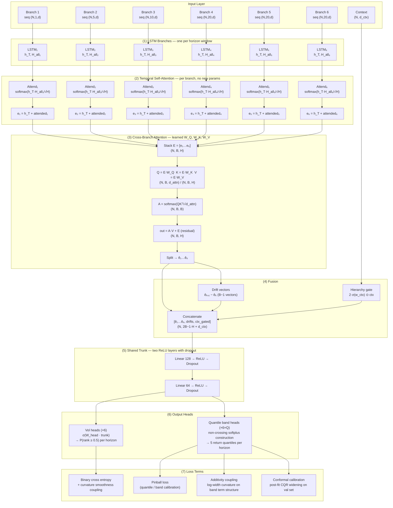

# Model Architecture: Multi-Scale Volatility Term Structure Network with Dual Attention

**Document purpose:** Final report reference and software block diagram (SBD) source.
**Component:** `ucn/models/multiscale.py` — `MultiScaleTermStructureNet`

---

## 1. Overview

The model predicts realized volatility across six horizons simultaneously, ranging from intraday minutes to 180-day daily. Six LSTM branches, one per horizon, each read a different lookback window of the feature sequence. Their embeddings are refined by a dual attention mechanism before being fused through a shared trunk that produces six probability heads and five quantile band heads.

---

## 2. Software Block Diagram

---

## 3. Component Descriptions

### (1) LSTM Branches

Six independent LSTM branches, each processing a different lookback window at the same feature resolution (daily or intraday). The branch windows are `[1, 5, 10, 20, 20, 20]` timesteps for the daily scale and `[1, 3, 6, 12, 20, 20]` for intraday. Each branch returns the final hidden state `h_T` (N, H) **and** all intermediate hidden states `H_all` (N, T, H) for the temporal attention step.

### (2) Temporal Self-Attention (Option A)

Each branch independently re-weights its own sequence using the final hidden state as a parameter-free query:

$$\alpha_t^{(b)} = \frac{\exp(h_T^{(b)} \cdot h_t^{(b)} / \sqrt{H})}{\sum_{t'} \exp(h_T^{(b)} \cdot h_{t'}^{(b)} / \sqrt{H})}$$

$$\text{attended}^{(b)} = \sum_t \alpha_t^{(b)} h_t^{(b)}$$

The attended context is added to `h_T` as a residual skip:

$$e_b = h_T^{(b)} + \text{attended}^{(b)}$$

This lets each branch soft-select the most predictive past timestep rather than relying only on the LSTM's compressed final state. No new parameters are introduced; gradients flow through the softmax weights back into BPTT via a per-step `d_H_all` injection in `_lstm_backward`.

### (3) Cross-Branch Attention (Option B)

The six post-temporal-attention embeddings `{e_1, …, e_6}` are stacked into a matrix `E` (N, B, H) and processed by a single-head self-attention layer with learned projections:

$$Q = E W_Q, \quad K = E W_K \quad (N, B, d_{\text{attn}}), \quad V = E W_V \quad (N, B, H)$$

$$A = \text{softmax}\!\left(\frac{QK^\top}{\sqrt{d_{\text{attn}}}}\right), \quad \hat{E} = A V + E \quad (N, B, H)$$

where `d_attn = H // 2 = 12`. The residual skip (`+ E`) ensures the layer is a neutral pass-through at initialization (`W_V` starts as the identity). This layer lets each horizon's embedding attend to all other horizons, implementing the heterogeneous-autoregressive (HAR) insight that long-horizon realized volatility informs short-horizon prediction.

### (4) Fusion

Attended embeddings `{ê_1, …, ê_6}` are concatenated with five pairwise drift vectors `{ê_{k+1} − ê_k}` and a gated cross-sectional context vector. The drift vectors carry the rate of change across scale and have been part of the model since the original design.

### (5) Shared Trunk

Two dense ReLU layers (128 → 64) with dropout (rate 0.3) applied during training. All heads share this representation.

### (6) Output Heads

- **Volatility heads** (×6): sigmoid outputs, one per horizon, trained as binary classifiers (top/bottom tail of the cross-sectional volatility rank).
- **Quantile band heads** (×6×5): non-crossing construction via softplus increments, trained with the asymmetric pinball loss. Calibrated post-fit using conformal quantile regression (CQR).

### (7) Loss Terms

| Term | Formula | Purpose |
|---|---|---|
| Binary cross entropy | $-y \log p - (1-y)\log(1-p)$ | Volatility rank prediction |
| Curvature smoothness | $\lambda_s \sum_h (\Delta^2 P)_h^2$ | Penalizes non-smooth term structures |
| Pinball (quantile) | $\tau e \mathbf{1}[e>0] + (\tau-1)e \mathbf{1}[e\le0]$ | Band calibration |
| Additivity coupling | $\lambda_a \sum_h (\Delta^2 \log w)_h^2$ | Enforces $w \propto \sqrt{H}$ variance scaling |
| Conformal CQR | Post-fit quantile widening on val set | Guaranteed coverage $1-\alpha$ |

---

## 4. Parameter Count

| Component | Parameters | Count (H=24, d=13, B=6, d_ctx=25) |
|---|---|---|
| LSTM branches (×6) | W, U, b per branch | 6 × (13×96 + 24×96 + 96) = 6 × 3,552 = 21,312 |
| Cross-branch attention | W_Q, W_K (24→12), W_V (24→24) | 24×12 + 24×12 + 24×24 = 1,152 |
| Trunk FC layers | W1 (143×128), W2 (128×64) | 18,304 + 8,192 = 26,496 |
| Output heads | W_head (64×6), W_q (64×30) | 384 + 1,920 = 2,304 |
| Context gate | w_ctx (25,) | 25 |
| **Total** | | **~51,289** |

The temporal attention adds zero new parameters (the query is `h_T` itself). The cross-branch attention adds 1,152 parameters (~2.2% of the total).

---

## 5. Training Configuration (final run)

| Hyperparameter | Value |
|---|---|
| Batch size | 4096 |
| Max epochs | 3000 |
| Early stopping patience | 150 |
| Optimizer | Adam (β₁=0.9, β₂=0.999) |
| LR schedule | Reduce-on-plateau (decay 0.5, patience 40, min 1e-5) |
| Regularization | L2 weight decay 1e-3 |
| Dropout | 0.3 |
| Smooth lambda | 0.3 |
| Additivity lambda | 0.5 |
| Label split | Extreme 0.3 (top/bottom 30%) |
| Context features | MI-selected top 25 of 82 |
| Context selection | Mutual information w.r.t. 90-day label |

---

## 6. Key Results (loose-keep label-pct 0.3, pre-attention baseline)

| Scale | Horizon | AUC |
|---|---|---|
| Intraday | 5m | 0.738 |
| Intraday | 30m | 0.915 |
| Intraday | 120m | 0.980 |
| Intraday | 240m | 0.988 |
| Daily | 1d | 0.703 |
| Daily | 30d | 0.956 |
| Daily | 90d | 0.979 |
| Daily | 180d | 0.983 |

Band coverage (90% target): 0.897–0.971 across all horizons. Decision ledger: 573,330 rows, 522 tickers.
